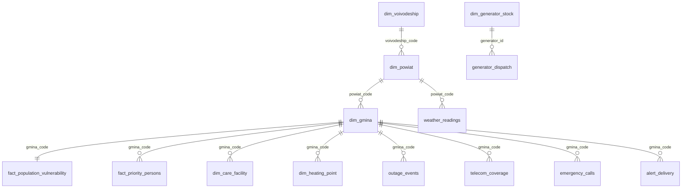

# Model danych

Dokument opisuje wszystkie tabele i strumienie scenariusza „Tarcza Zimowa”. Dane są syntetyczne, deterministyczne (`seed=42`), kodowane UTF-8, z technicznymi nazwami pól po angielsku. Kody TERYT są syntetyczne w formacie województwo 2 znaki, powiat 4, gmina 7. Model celowo rozdziela agregaty wrażliwości od fikcyjnych danych osób priorytetowych, żeby pokazać privacy-by-design.

## Wolumeny i wyniki modelu

- Rekordy: 2477 gmin, 380 powiatów, 900 placówek opieki, 500 punktów grzewczych, 420 agregatów, 1250 fikcyjnych osób priorytetowych.
- Strumienie: pogoda 201020, awarie 6650, łączność 522647, zgłoszenia 112 5285, status punktów 330, wydania agregatów 260, wizyty 202, alerty 7431.
- IWL: średnia 63.03, P90 79.83, top gmina 2817005.
- IZŻ: gminy krytyczne 14, osoby wrażliwe bez zasilania 317,719, maks. czas bez prądu 59.3 h.
- Optymalizacja: wybrano 80 punktów, przydzielono 29 agregatów; pokrycie 36.7% vs 13.1% „po równo” (+23.6 p.p.).
- Wizyty: kolejka 500 osób, pierwsza zmiana obsługuje 147 wizyt, zespoły 16; w Top100 jest 37 pacjentów tlenoterapii i 11 dializowanych.
- What-if: gminy krytyczne rosną z 14 do 104 (+90).

## Diagram relacji



## Logika generowania i realizm scenariusza

**Kaskada awarii:** generator wybiera gminy w województwach podlaskim, warmińsko-mazurskim, mazowieckim i lubelskim, preferując gminy z wysoką wrażliwością. Zdarzenia `outage_events` pojawiają się falami `cascade_stage` 1–3. Status przechodzi przez `outage`, `partial_restoration`, `restored`, a liczba odbiorców bez prądu spada dopiero po ETA. To daje realistyczny obraz: awaria nie jest jednorazowym rekordem, tylko procesem.

**BTS i łączność:** `telecom_coverage` jest generowany godzinowo. Gminy bez prądu zaczynają tracić zasięg po 4–8 godzinach, gdy wyczerpuje się bateria stacji bazowych. Dlatego `coverage_pct` spada w miarę trwania awarii i staje się czynnikiem IZŻ.

**Autonomia placówek:** `dim_care_facility` zawiera `has_generator`, `generator_autonomy_hours` i `power_need_kw`. Placówki bez agregatu albo z autonomią poniżej 2 godzin są kandydatami do reguł Activator i decyzji wojewody.

**Zgłoszenia 112:** `emergency_calls` rosną wraz z czasem od D0, mrozem i brakiem zasilania. Typy zgłoszeń obejmują wychłodzenie, brak ogrzewania, awarię sprzętu medycznego, uwięzienie w pojeździe i prośbę o welfare check.

**IWL i IZŻ:** IWL jest ważoną sumą czynników demograficznych, zdrowotnych, infrastrukturalnych i geograficznych. IZŻ łączy IWL, temperaturę odczuwalną, godziny bez zasilania, spadek łączności i czas dojazdu ratownictwa.

## `dim_voivodeship.csv`

**Ziarno:** `voivodeship_code`  
**Liczba rekordów:** 16

| Kolumna | Typ | Opis | Przykład | Dopuszczalne wartości |
|---|---|---|---|---|
| `voivodeship_code` | string | Kod województwa. | `02` | wg słownika / zakres realistyczny |
| `voivodeship_name` | string | Pole syntetyczne używane w scenariuszu i relacjach analitycznych. | `dolnośląskie` | wg słownika / zakres realistyczny |
| `lat` | real | Pole syntetyczne używane w scenariuszu i relacjach analitycznych. | `51.1` | wg słownika / zakres realistyczny |
| `lon` | real | Pole syntetyczne używane w scenariuszu i relacjach analitycznych. | `16.9` | wg słownika / zakres realistyczny |
| `scenario_axis` | string | Pole syntetyczne używane w scenariuszu i relacjach analitycznych. | `national_context` | wg słownika / zakres realistyczny |

**Przykładowy rekord:**

```json
{
  "voivodeship_code": "02",
  "voivodeship_name": "dolnośląskie",
  "lat": "51.1",
  "lon": "16.9",
  "scenario_axis": "national_context"
}
```

## `dim_powiat.csv`

**Ziarno:** `powiat_code`  
**Liczba rekordów:** 380

| Kolumna | Typ | Opis | Przykład | Dopuszczalne wartości |
|---|---|---|---|---|
| `powiat_code` | string | Syntetyczny kod TERYT powiatu. | `0201` | wg słownika / zakres realistyczny |
| `voivodeship_code` | string | Kod województwa. | `02` | wg słownika / zakres realistyczny |
| `powiat_name` | string | Pole syntetyczne używane w scenariuszu i relacjach analitycznych. | `powiat dolnośląskie-południowy-01` | wg słownika / zakres realistyczny |
| `lat` | real | Pole syntetyczne używane w scenariuszu i relacjach analitycznych. | `51.21579` | wg słownika / zakres realistyczny |
| `lon` | real | Pole syntetyczne używane w scenariuszu i relacjach analitycznych. | `16.32801` | wg słownika / zakres realistyczny |

**Przykładowy rekord:**

```json
{
  "powiat_code": "0201",
  "voivodeship_code": "02",
  "powiat_name": "powiat dolnośląskie-południowy-01",
  "lat": "51.21579",
  "lon": "16.32801"
}
```

## `dim_gmina.csv`

**Ziarno:** `gmina_code`  
**Liczba rekordów:** 2477

| Kolumna | Typ | Opis | Przykład | Dopuszczalne wartości |
|---|---|---|---|---|
| `gmina_code` | string | Syntetyczny kod TERYT gminy, klucz do relacji przestrzennych. | `0201001` | wg słownika / zakres realistyczny |
| `powiat_code` | string | Syntetyczny kod TERYT powiatu. | `0201` | wg słownika / zakres realistyczny |
| `voivodeship_code` | string | Kod województwa. | `02` | wg słownika / zakres realistyczny |
| `gmina_name` | string | Pole syntetyczne używane w scenariuszu i relacjach analitycznych. | `gmina dolnośląskie-południowy-01-01` | wg słownika / zakres realistyczny |
| `gmina_type` | string | Pole syntetyczne używane w scenariuszu i relacjach analitycznych. | `wiejska` | wartości słownikowe z generatora |
| `population` | integer | Pole syntetyczne używane w scenariuszu i relacjach analitycznych. | `17584` | wg słownika / zakres realistyczny |
| `population_density` | string | Pole syntetyczne używane w scenariuszu i relacjach analitycznych. | `72.2` | wg słownika / zakres realistyczny |
| `lat` | real | Pole syntetyczne używane w scenariuszu i relacjach analitycznych. | `51.30459` | wg słownika / zakres realistyczny |
| `lon` | real | Pole syntetyczne używane w scenariuszu i relacjach analitycznych. | `16.44265` | wg słownika / zakres realistyczny |
| `rurality_index` | string | Pole syntetyczne używane w scenariuszu i relacjach analitycznych. | `1` | wg słownika / zakres realistyczny |

**Przykładowy rekord:**

```json
{
  "gmina_code": "0201001",
  "powiat_code": "0201",
  "voivodeship_code": "02",
  "gmina_name": "gmina dolnośląskie-południowy-01-01",
  "gmina_type": "wiejska",
  "population": "17584",
  "population_density": "72.2",
  "lat": "51.30459",
  "lon": "16.44265",
  "rurality_index": "1"
}
```

## `dim_vulnerability_factors.csv`

**Ziarno:** `factor_code`  
**Liczba rekordów:** 13

| Kolumna | Typ | Opis | Przykład | Dopuszczalne wartości |
|---|---|---|---|---|
| `factor_code` | string | Pole syntetyczne używane w scenariuszu i relacjach analitycznych. | `share_75_plus` | wg słownika / zakres realistyczny |
| `weight` | string | Pole syntetyczne używane w scenariuszu i relacjach analitycznych. | `0.1` | wg słownika / zakres realistyczny |
| `description` | string | Pole syntetyczne używane w scenariuszu i relacjach analitycznych. | `Odsetek ludności 75+` | wg słownika / zakres realistyczny |
| `normalization` | string | Pole syntetyczne używane w scenariuszu i relacjach analitycznych. | `min_max_0_1` | wg słownika / zakres realistyczny |

**Przykładowy rekord:**

```json
{
  "factor_code": "share_75_plus",
  "weight": "0.1",
  "description": "Odsetek ludności 75+",
  "normalization": "min_max_0_1"
}
```

## `fact_population_vulnerability.csv`

**Ziarno:** `gmina_code`  
**Liczba rekordów:** 2477

| Kolumna | Typ | Opis | Przykład | Dopuszczalne wartości |
|---|---|---|---|---|
| `gmina_code` | string | Syntetyczny kod TERYT gminy, klucz do relacji przestrzennych. | `0201001` | wg słownika / zakres realistyczny |
| `population` | integer | Pole syntetyczne używane w scenariuszu i relacjach analitycznych. | `17584` | wg słownika / zakres realistyczny |
| `share_75_plus` | string | Pole syntetyczne używane w scenariuszu i relacjach analitycznych. | `0.1033` | wg słownika / zakres realistyczny |
| `single_senior_households` | string | Pole syntetyczne używane w scenariuszu i relacjach analitycznych. | `0.1144` | wg słownika / zakres realistyczny |
| `home_oxygen_patients` | string | Pole syntetyczne używane w scenariuszu i relacjach analitycznych. | `10` | wg słownika / zakres realistyczny |
| `dialysis_patients` | string | Pole syntetyczne używane w scenariuszu i relacjach analitycznych. | `5` | wg słownika / zakres realistyczny |
| `disability_share` | string | Pole syntetyczne używane w scenariuszu i relacjach analitycznych. | `0.1242` | wg słownika / zakres realistyczny |
| `care_facility_pressure` | string | Pole syntetyczne używane w scenariuszu i relacjach analitycznych. | `0.8127` | wg słownika / zakres realistyczny |
| `children_facilities` | string | Pole syntetyczne używane w scenariuszu i relacjach analitycznych. | `2` | wg słownika / zakres realistyczny |
| `electric_heating_pct` | string | Pole syntetyczne używane w scenariuszu i relacjach analitycznych. | `0.2397` | wg słownika / zakres realistyczny |
| `no_alt_heat_buildings_pct` | string | Pole syntetyczne używane w scenariuszu i relacjach analitycznych. | `0.2909` | wg słownika / zakres realistyczny |
| `energy_poverty_pct` | string | Pole syntetyczne używane w scenariuszu i relacjach analitycznych. | `0.1793` | wg słownika / zakres realistyczny |
| `remote_rurality` | string | Pole syntetyczne używane w scenariuszu i relacjach analitycznych. | `1` | wg słownika / zakres realistyczny |
| `telecom_gap_pct` | string | Pole syntetyczne używane w scenariuszu i relacjach analitycznych. | `0.2527` | wg słownika / zakres realistyczny |
| `rescue_travel_time_min` | string | Pole syntetyczne używane w scenariuszu i relacjach analitycznych. | `32.1` | wg słownika / zakres realistyczny |
| `vulnerable_population_est` | string | Pole syntetyczne używane w scenariuszu i relacjach analitycznych. | `3039` | wg słownika / zakres realistyczny |

**Przykładowy rekord:**

```json
{
  "gmina_code": "0201001",
  "population": "17584",
  "share_75_plus": "0.1033",
  "single_senior_households": "0.1144",
  "home_oxygen_patients": "10",
  "dialysis_patients": "5",
  "disability_share": "0.1242",
  "care_facility_pressure": "0.8127",
  "children_facilities": "2",
  "electric_heating_pct": "0.2397",
  "no_alt_heat_buildings_pct": "0.2909",
  "energy_poverty_pct": "0.1793",
  "remote_rurality": "1",
  "telecom_gap_pct": "0.2527",
  "rescue_travel_time_min": "32.1",
  "vulnerable_population_est": "3039"
}
```

## `fact_priority_persons.csv`

**Ziarno:** `person_token` — wyłącznie fikcyjne rekordy demo  
**Liczba rekordów:** 1250

| Kolumna | Typ | Opis | Przykład | Dopuszczalne wartości |
|---|---|---|---|---|
| `person_token` | string | Fikcyjny pseudonimowany identyfikator osoby priorytetowej. | `PRIO-00001` | wg słownika / zakres realistyczny |
| `category` | string | Pole syntetyczne używane w scenariuszu i relacjach analitycznych. | `dialysis` | wartości słownikowe z generatora |
| `gmina_code` | string | Syntetyczny kod TERYT gminy, klucz do relacji przestrzennych. | `1222005` | wg słownika / zakres realistyczny |
| `age_band` | string | Pole syntetyczne używane w scenariuszu i relacjach analitycznych. | `18-74` | wg słownika / zakres realistyczny |
| `medical_device_autonomy_hours` | string | Pole syntetyczne używane w scenariuszu i relacjach analitycznych. | `8.4` | wg słownika / zakres realistyczny |
| `fictional_contact` | string | Pole syntetyczne używane w scenariuszu i relacjach analitycznych. | `+48-000-000-001` | wg słownika / zakres realistyczny |
| `is_living_alone` | boolean | Pole syntetyczne używane w scenariuszu i relacjach analitycznych. | `False` | wg słownika / zakres realistyczny |
| `sensitivity_label` | string | Etykieta wrażliwości informacyjnej dla Purview/RLS. | `Highly Confidential - synthetic priority person` | wg słownika / zakres realistyczny |
| `privacy_note` | string | Pole syntetyczne używane w scenariuszu i relacjach analitycznych. | `FIKCYJNE dane demo; w realnym wdrożeniu Purview/RLS/minimalizacja/retencja` | wg słownika / zakres realistyczny |

**Przykładowy rekord:**

```json
{
  "person_token": "PRIO-00001",
  "category": "dialysis",
  "gmina_code": "1222005",
  "age_band": "18-74",
  "medical_device_autonomy_hours": "8.4",
  "fictional_contact": "+48-000-000-001",
  "is_living_alone": "False",
  "sensitivity_label": "Highly Confidential - synthetic priority person",
  "privacy_note": "FIKCYJNE dane demo; w realnym wdrożeniu Purview/RLS/minimalizacja/retencja"
}
```

## `dim_care_facility.csv`

**Ziarno:** `facility_id`  
**Liczba rekordów:** 900

| Kolumna | Typ | Opis | Przykład | Dopuszczalne wartości |
|---|---|---|---|---|
| `facility_id` | string | Pole syntetyczne używane w scenariuszu i relacjach analitycznych. | `FAC-0001` | wg słownika / zakres realistyczny |
| `facility_type` | string | Pole syntetyczne używane w scenariuszu i relacjach analitycznych. | `hospital` | wartości słownikowe z generatora |
| `facility_name` | string | Pole syntetyczne używane w scenariuszu i relacjach analitycznych. | `hospital 0001` | wg słownika / zakres realistyczny |
| `gmina_code` | string | Syntetyczny kod TERYT gminy, klucz do relacji przestrzennych. | `0623002` | wg słownika / zakres realistyczny |
| `capacity` | integer | Pole syntetyczne używane w scenariuszu i relacjach analitycznych. | `189` | wg słownika / zakres realistyczny |
| `current_occupancy` | integer | Pole syntetyczne używane w scenariuszu i relacjach analitycznych. | `178` | wg słownika / zakres realistyczny |
| `has_generator` | boolean | Pole syntetyczne używane w scenariuszu i relacjach analitycznych. | `True` | wg słownika / zakres realistyczny |
| `generator_autonomy_hours` | string | Pole syntetyczne używane w scenariuszu i relacjach analitycznych. | `4.5` | wg słownika / zakres realistyczny |
| `power_need_kw` | real | Pole syntetyczne używane w scenariuszu i relacjach analitycznych. | `93.3` | wg słownika / zakres realistyczny |
| `lat` | real | Pole syntetyczne używane w scenariuszu i relacjach analitycznych. | `51.12071` | wg słownika / zakres realistyczny |
| `lon` | real | Pole syntetyczne używane w scenariuszu i relacjach analitycznych. | `21.88894` | wg słownika / zakres realistyczny |
| `sensitivity_label` | string | Etykieta wrażliwości informacyjnej dla Purview/RLS. | `Confidential - synthetic health/care aggregate` | wg słownika / zakres realistyczny |

**Przykładowy rekord:**

```json
{
  "facility_id": "FAC-0001",
  "facility_type": "hospital",
  "facility_name": "hospital 0001",
  "gmina_code": "0623002",
  "capacity": "189",
  "current_occupancy": "178",
  "has_generator": "True",
  "generator_autonomy_hours": "4.5",
  "power_need_kw": "93.3",
  "lat": "51.12071",
  "lon": "21.88894",
  "sensitivity_label": "Confidential - synthetic health/care aggregate"
}
```

## `dim_heating_point.csv`

**Ziarno:** `heating_point_id`  
**Liczba rekordów:** 500

| Kolumna | Typ | Opis | Przykład | Dopuszczalne wartości |
|---|---|---|---|---|
| `heating_point_id` | string | Pole syntetyczne używane w scenariuszu i relacjach analitycznych. | `HP-0001` | wg słownika / zakres realistyczny |
| `heating_point_type` | string | Pole syntetyczne używane w scenariuszu i relacjach analitycznych. | `community_hall` | wg słownika / zakres realistyczny |
| `gmina_code` | string | Syntetyczny kod TERYT gminy, klucz do relacji przestrzennych. | `2603004` | wg słownika / zakres realistyczny |
| `capacity` | integer | Pole syntetyczne używane w scenariuszu i relacjach analitycznych. | `130` | wg słownika / zakres realistyczny |
| `has_generator` | boolean | Pole syntetyczne używane w scenariuszu i relacjach analitycznych. | `False` | wg słownika / zakres realistyczny |
| `has_independent_stove` | boolean | Pole syntetyczne używane w scenariuszu i relacjach analitycznych. | `False` | wg słownika / zakres realistyczny |
| `availability_status` | string | Pole syntetyczne używane w scenariuszu i relacjach analitycznych. | `available` | wg słownika / zakres realistyczny |
| `power_need_kw` | real | Pole syntetyczne używane w scenariuszu i relacjach analitycznych. | `21.3` | wg słownika / zakres realistyczny |
| `lat` | real | Pole syntetyczne używane w scenariuszu i relacjach analitycznych. | `50.74079` | wg słownika / zakres realistyczny |
| `lon` | real | Pole syntetyczne używane w scenariuszu i relacjach analitycznych. | `19.78139` | wg słownika / zakres realistyczny |

**Przykładowy rekord:**

```json
{
  "heating_point_id": "HP-0001",
  "heating_point_type": "community_hall",
  "gmina_code": "2603004",
  "capacity": "130",
  "has_generator": "False",
  "has_independent_stove": "False",
  "availability_status": "available",
  "power_need_kw": "21.3",
  "lat": "50.74079",
  "lon": "19.78139"
}
```

## `dim_grid_asset.csv`

**Ziarno:** `grid_asset_id`  
**Liczba rekordów:** 600

| Kolumna | Typ | Opis | Przykład | Dopuszczalne wartości |
|---|---|---|---|---|
| `grid_asset_id` | string | Pole syntetyczne używane w scenariuszu i relacjach analitycznych. | `GRID-0001` | wg słownika / zakres realistyczny |
| `asset_type` | string | Pole syntetyczne używane w scenariuszu i relacjach analitycznych. | `MV_line` | wg słownika / zakres realistyczny |
| `operator_region` | string | Pole syntetyczne używane w scenariuszu i relacjach analitycznych. | `20` | wg słownika / zakres realistyczny |
| `primary_gmina_code` | string | Pole syntetyczne używane w scenariuszu i relacjach analitycznych. | `2007003` | wg słownika / zakres realistyczny |
| `served_gminas` | string | Pole syntetyczne używane w scenariuszu i relacjach analitycznych. | `2007003|2802006|2602004|1421001|3205006` | wg słownika / zakres realistyczny |
| `customers_served` | string | Pole syntetyczne używane w scenariuszu i relacjach analitycznych. | `24628` | wg słownika / zakres realistyczny |
| `lat` | real | Pole syntetyczne używane w scenariuszu i relacjach analitycznych. | `52.91939` | wg słownika / zakres realistyczny |
| `lon` | real | Pole syntetyczne używane w scenariuszu i relacjach analitycznych. | `22.38979` | wg słownika / zakres realistyczny |
| `icing_susceptibility` | string | Pole syntetyczne używane w scenariuszu i relacjach analitycznych. | `0.72` | wg słownika / zakres realistyczny |

**Przykładowy rekord:**

```json
{
  "grid_asset_id": "GRID-0001",
  "asset_type": "MV_line",
  "operator_region": "20",
  "primary_gmina_code": "2007003",
  "served_gminas": "2007003|2802006|2602004|1421001|3205006",
  "customers_served": "24628",
  "lat": "52.91939",
  "lon": "22.38979",
  "icing_susceptibility": "0.72"
}
```

## `dim_generator_stock.csv`

**Ziarno:** `generator_id`  
**Liczba rekordów:** 420

| Kolumna | Typ | Opis | Przykład | Dopuszczalne wartości |
|---|---|---|---|---|
| `generator_id` | string | Pole syntetyczne używane w scenariuszu i relacjach analitycznych. | `GEN-0001` | wg słownika / zakres realistyczny |
| `warehouse_id` | string | Pole syntetyczne używane w scenariuszu i relacjach analitycznych. | `RARS-LUB` | wg słownika / zakres realistyczny |
| `voivodeship_code` | string | Kod województwa. | `06` | wg słownika / zakres realistyczny |
| `power_kw` | real | Pole syntetyczne używane w scenariuszu i relacjach analitycznych. | `50` | wg słownika / zakres realistyczny |
| `fuel_type` | string | Pole syntetyczne używane w scenariuszu i relacjach analitycznych. | `LPG` | wg słownika / zakres realistyczny |
| `mobility_type` | string | Pole syntetyczne używane w scenariuszu i relacjach analitycznych. | `trailer` | wg słownika / zakres realistyczny |
| `status` | string | Pole syntetyczne używane w scenariuszu i relacjach analitycznych. | `available` | wartości słownikowe z generatora |
| `lat` | real | Pole syntetyczne używane w scenariuszu i relacjach analitycznych. | `51.25` | wg słownika / zakres realistyczny |
| `lon` | real | Pole syntetyczne używane w scenariuszu i relacjach analitycznych. | `22.57` | wg słownika / zakres realistyczny |

**Przykładowy rekord:**

```json
{
  "generator_id": "GEN-0001",
  "warehouse_id": "RARS-LUB",
  "voivodeship_code": "06",
  "power_kw": "50",
  "fuel_type": "LPG",
  "mobility_type": "trailer",
  "status": "available",
  "lat": "51.25",
  "lon": "22.57"
}
```

## `weather_readings.jsonl`

**Ziarno:** `event_time + powiat_code`  
**Liczba rekordów:** 201020

| Kolumna | Typ | Opis | Przykład | Dopuszczalne wartości |
|---|---|---|---|---|
| `event_time` | datetime | Czas zdarzenia w ISO-8601 z offsetem +02:00. | `2026-01-12T00:00+02:00` | wg słownika / zakres realistyczny |
| `powiat_code` | string | Syntetyczny kod TERYT powiatu. | `0201` | wg słownika / zakres realistyczny |
| `temperature_c` | real | Pole syntetyczne używane w scenariuszu i relacjach analitycznych. | `-7.7` | wg słownika / zakres realistyczny |
| `feels_like_c` | real | Pole syntetyczne używane w scenariuszu i relacjach analitycznych. | `-10.5` | wg słownika / zakres realistyczny |
| `wind_kmh` | real | Pole syntetyczne używane w scenariuszu i relacjach analitycznych. | `23.5` | wg słownika / zakres realistyczny |
| `snow_cm_30m` | real | Pole syntetyczne używane w scenariuszu i relacjach analitycznych. | `0.16` | wg słownika / zakres realistyczny |
| `icing_index` | integer | Pole syntetyczne używane w scenariuszu i relacjach analitycznych. | `0` | wg słownika / zakres realistyczny |

**Przykładowy rekord:**

```json
{
  "event_time": "2026-01-12T00:00+02:00",
  "powiat_code": "0201",
  "temperature_c": -7.7,
  "feels_like_c": -10.5,
  "wind_kmh": 23.5,
  "snow_cm_30m": 0.16,
  "icing_index": 0
}
```

## `outage_events.jsonl`

**Ziarno:** `event_time + outage_id + gmina_code`  
**Liczba rekordów:** 6650

| Kolumna | Typ | Opis | Przykład | Dopuszczalne wartości |
|---|---|---|---|---|
| `event_time` | datetime | Czas zdarzenia w ISO-8601 z offsetem +02:00. | `2026-01-14T12:12+02:00` | wg słownika / zakres realistyczny |
| `outage_id` | string | Pole syntetyczne używane w scenariuszu i relacjach analitycznych. | `OUT-0001` | wg słownika / zakres realistyczny |
| `grid_asset_id` | string | Pole syntetyczne używane w scenariuszu i relacjach analitycznych. | `GRID-0220` | wg słownika / zakres realistyczny |
| `gmina_code` | string | Syntetyczny kod TERYT gminy, klucz do relacji przestrzennych. | `2011004` | wg słownika / zakres realistyczny |
| `status` | string | Pole syntetyczne używane w scenariuszu i relacjach analitycznych. | `outage` | wartości słownikowe z generatora |
| `customers_without_power` | integer | Pole syntetyczne używane w scenariuszu i relacjach analitycznych. | `29338` | wg słownika / zakres realistyczny |
| `eta_restore_time` | string | Pole syntetyczne używane w scenariuszu i relacjach analitycznych. | `2026-01-16T12:53+02:00` | wg słownika / zakres realistyczny |
| `cascade_stage` | integer | Pole syntetyczne używane w scenariuszu i relacjach analitycznych. | `1` | wg słownika / zakres realistyczny |
| `root_cause` | string | Pole syntetyczne używane w scenariuszu i relacjach analitycznych. | `icing_cascade_overload` | wg słownika / zakres realistyczny |

**Przykładowy rekord:**

```json
{
  "event_time": "2026-01-14T12:12+02:00",
  "outage_id": "OUT-0001",
  "grid_asset_id": "GRID-0220",
  "gmina_code": "2011004",
  "status": "outage",
  "customers_without_power": 29338,
  "eta_restore_time": "2026-01-16T12:53+02:00",
  "cascade_stage": 1,
  "root_cause": "icing_cascade_overload"
}
```

## `telecom_coverage.jsonl`

**Ziarno:** `event_time + gmina_code`  
**Liczba rekordów:** 522647

| Kolumna | Typ | Opis | Przykład | Dopuszczalne wartości |
|---|---|---|---|---|
| `event_time` | datetime | Czas zdarzenia w ISO-8601 z offsetem +02:00. | `2026-01-14T06:00+02:00` | wg słownika / zakres realistyczny |
| `gmina_code` | string | Syntetyczny kod TERYT gminy, klucz do relacji przestrzennych. | `0201001` | wg słownika / zakres realistyczny |
| `bts_total` | integer | Pole syntetyczne używane w scenariuszu i relacjach analitycznych. | `3` | wg słownika / zakres realistyczny |
| `bts_on_battery` | integer | Pole syntetyczne używane w scenariuszu i relacjach analitycznych. | `0` | wg słownika / zakres realistyczny |
| `coverage_pct` | real | Udział pokrycia telekomunikacyjnego gminy. | `0.662` | wg słownika / zakres realistyczny |
| `battery_hours_remaining` | string | Pole syntetyczne używane w scenariuszu i relacjach analitycznych. | `` | wg słownika / zakres realistyczny |

**Przykładowy rekord:**

```json
{
  "event_time": "2026-01-14T06:00+02:00",
  "gmina_code": "0201001",
  "bts_total": 3,
  "bts_on_battery": 0,
  "coverage_pct": 0.662,
  "battery_hours_remaining": ""
}
```

## `emergency_calls.jsonl`

**Ziarno:** `call_id`  
**Liczba rekordów:** 5285

| Kolumna | Typ | Opis | Przykład | Dopuszczalne wartości |
|---|---|---|---|---|
| `event_time` | datetime | Czas zdarzenia w ISO-8601 z offsetem +02:00. | `2026-01-12T00:06+02:00` | wg słownika / zakres realistyczny |
| `call_id` | string | Pole syntetyczne używane w scenariuszu i relacjach analitycznych. | `112-000001` | wg słownika / zakres realistyczny |
| `gmina_code` | string | Syntetyczny kod TERYT gminy, klucz do relacji przestrzennych. | `1406007` | wg słownika / zakres realistyczny |
| `call_type` | string | Pole syntetyczne używane w scenariuszu i relacjach analitycznych. | `no_heating` | wg słownika / zakres realistyczny |
| `priority` | string | Pole syntetyczne używane w scenariuszu i relacjach analitycznych. | `P3` | wartości słownikowe z generatora |
| `description` | string | Pole syntetyczne używane w scenariuszu i relacjach analitycznych. | `synthetic emergency call - no personal data` | wg słownika / zakres realistyczny |

**Przykładowy rekord:**

```json
{
  "event_time": "2026-01-12T00:06+02:00",
  "call_id": "112-000001",
  "gmina_code": "1406007",
  "call_type": "no_heating",
  "priority": "P3",
  "description": "synthetic emergency call - no personal data"
}
```

## `heating_point_status.jsonl`

**Ziarno:** `event_time + heating_point_id`  
**Liczba rekordów:** 330

| Kolumna | Typ | Opis | Przykład | Dopuszczalne wartości |
|---|---|---|---|---|
| `event_time` | datetime | Czas zdarzenia w ISO-8601 z offsetem +02:00. | `2026-01-15T08:09+02:00` | wg słownika / zakres realistyczny |
| `heating_point_id` | string | Pole syntetyczne używane w scenariuszu i relacjach analitycznych. | `HP-0010` | wg słownika / zakres realistyczny |
| `gmina_code` | string | Syntetyczny kod TERYT gminy, klucz do relacji przestrzennych. | `0622004` | wg słownika / zakres realistyczny |
| `status` | string | Pole syntetyczne używane w scenariuszu i relacjach analitycznych. | `open` | wartości słownikowe z generatora |
| `occupancy` | integer | Pole syntetyczne używane w scenariuszu i relacjach analitycznych. | `66` | wg słownika / zakres realistyczny |
| `capacity` | integer | Pole syntetyczne używane w scenariuszu i relacjach analitycznych. | `77` | wg słownika / zakres realistyczny |
| `needs_food` | boolean | Pole syntetyczne używane w scenariuszu i relacjach analitycznych. | `True` | wg słownika / zakres realistyczny |
| `needs_medical_support` | boolean | Pole syntetyczne używane w scenariuszu i relacjach analitycznych. | `True` | wg słownika / zakres realistyczny |
| `needs_generator` | boolean | Pole syntetyczne używane w scenariuszu i relacjach analitycznych. | `True` | wg słownika / zakres realistyczny |

**Przykładowy rekord:**

```json
{
  "event_time": "2026-01-15T08:09+02:00",
  "heating_point_id": "HP-0010",
  "gmina_code": "0622004",
  "status": "open",
  "occupancy": 66,
  "capacity": 77,
  "needs_food": true,
  "needs_medical_support": true,
  "needs_generator": true
}
```

## `generator_dispatch.jsonl`

**Ziarno:** `dispatch_id`  
**Liczba rekordów:** 260

| Kolumna | Typ | Opis | Przykład | Dopuszczalne wartości |
|---|---|---|---|---|
| `event_time` | datetime | Czas zdarzenia w ISO-8601 z offsetem +02:00. | `2026-01-15T20:21+02:00` | wg słownika / zakres realistyczny |
| `dispatch_id` | string | Pole syntetyczne używane w scenariuszu i relacjach analitycznych. | `DISP-0001` | wg słownika / zakres realistyczny |
| `generator_id` | string | Pole syntetyczne używane w scenariuszu i relacjach analitycznych. | `GEN-0001` | wg słownika / zakres realistyczny |
| `target_type` | string | Pole syntetyczne używane w scenariuszu i relacjach analitycznych. | `care_facility` | wg słownika / zakres realistyczny |
| `gmina_code` | string | Syntetyczny kod TERYT gminy, klucz do relacji przestrzennych. | `2011004` | wg słownika / zakres realistyczny |
| `status` | string | Pole syntetyczne używane w scenariuszu i relacjach analitycznych. | `planned` | wartości słownikowe z generatora |
| `power_kw` | real | Pole syntetyczne używane w scenariuszu i relacjach analitycznych. | `50` | wg słownika / zakres realistyczny |

**Przykładowy rekord:**

```json
{
  "event_time": "2026-01-15T20:21+02:00",
  "dispatch_id": "DISP-0001",
  "generator_id": "GEN-0001",
  "target_type": "care_facility",
  "gmina_code": "2011004",
  "status": "planned",
  "power_kw": 50
}
```

## `welfare_check.jsonl`

**Ziarno:** `visit_id`  
**Liczba rekordów:** 202

| Kolumna | Typ | Opis | Przykład | Dopuszczalne wartości |
|---|---|---|---|---|
| `event_time` | datetime | Czas zdarzenia w ISO-8601 z offsetem +02:00. | `2026-01-17T03:14+02:00` | wg słownika / zakres realistyczny |
| `visit_id` | string | Pole syntetyczne używane w scenariuszu i relacjach analitycznych. | `VIS-00001` | wg słownika / zakres realistyczny |
| `person_token` | string | Fikcyjny pseudonimowany identyfikator osoby priorytetowej. | `PRIO-00008` | wg słownika / zakres realistyczny |
| `gmina_code` | string | Syntetyczny kod TERYT gminy, klucz do relacji przestrzennych. | `2802003` | wg słownika / zakres realistyczny |
| `team_id` | string | Pole syntetyczne używane w scenariuszu i relacjach analitycznych. | `OSP-004` | wg słownika / zakres realistyczny |
| `result` | string | Pole syntetyczne używane w scenariuszu i relacjach analitycznych. | `no_contact` | wartości słownikowe z generatora |

**Przykładowy rekord:**

```json
{
  "event_time": "2026-01-17T03:14+02:00",
  "visit_id": "VIS-00001",
  "person_token": "PRIO-00008",
  "gmina_code": "2802003",
  "team_id": "OSP-004",
  "result": "no_contact"
}
```

## `alert_delivery.jsonl`

**Ziarno:** `event_time + gmina_code + channel`  
**Liczba rekordów:** 7431

| Kolumna | Typ | Opis | Przykład | Dopuszczalne wartości |
|---|---|---|---|---|
| `event_time` | datetime | Czas zdarzenia w ISO-8601 z offsetem +02:00. | `2026-01-14T08:36+02:00` | wg słownika / zakres realistyczny |
| `gmina_code` | string | Syntetyczny kod TERYT gminy, klucz do relacji przestrzennych. | `0201001` | wg słownika / zakres realistyczny |
| `channel` | string | Pole syntetyczne używane w scenariuszu i relacjach analitycznych. | `RSO` | wartości słownikowe z generatora |
| `messages_sent` | integer | Pole syntetyczne używane w scenariuszu i relacjach analitycznych. | `9671` | wg słownika / zakres realistyczny |
| `messages_delivered` | integer | Pole syntetyczne używane w scenariuszu i relacjach analitycznych. | `7638` | wg słownika / zakres realistyczny |
| `messages_opened` | integer | Pole syntetyczne używane w scenariuszu i relacjach analitycznych. | `2971` | wg słownika / zakres realistyczny |
| `spo_code` | string | Pole syntetyczne używane w scenariuszu i relacjach analitycznych. | `SPO-3` | wg słownika / zakres realistyczny |

**Przykładowy rekord:**

```json
{
  "event_time": "2026-01-14T08:36+02:00",
  "gmina_code": "0201001",
  "channel": "RSO",
  "messages_sent": 9671,
  "messages_delivered": 7638,
  "messages_opened": 2971,
  "spo_code": "SPO-3"
}
```
