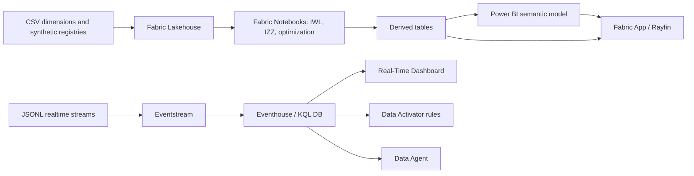

# ❄️ Tarcza Zimowa — Ochrona Ludności Wrażliwej

> ⚠️ **Disclaimer** — repozytorium demonstracyjne. Wszystkie dane są syntetyczne, wygenerowane proceduralnie (`generate_datasets.py`, seed=42). Projekt nie zawiera realnych danych osobowych ani danych operacyjnych instytucji. Lista osób priorytetowych jest fikcyjna, pseudonimowana i służy wyłącznie pokazaniu mechanizmu ochrony życia w warunkach blackoutu.

## Dla kogo jest to demo

Demo jest przeznaczone dla decydentów i zespołów: RCB, RZZK, MSWiA, Ministerstwa Zdrowia, MRPiPS, wojewodów, centrów zarządzania kryzysowego, samorządów oraz zespołów danych odpowiedzialnych za Microsoft Fabric. Jego celem nie jest pokazanie „ładnego dashboardu”, ale kompletnego procesu decyzyjnego: od prognozy mrozu, przez awarię, po dystrybucję agregatów, wizyty OSP i komunikat SPO-3.

## Problem biznesowy

W długotrwałej awarii zasilania przy temperaturze około -18°C informacja o liczbie odbiorców bez prądu nie wystarcza. Administracja musi wiedzieć, gdzie są osoby najbardziej narażone: seniorzy samotni, pacjenci tlenoterapii domowej, osoby dializowane, DPS/ZOL, noclegownie, gospodarstwa z ogrzewaniem elektrycznym i gminy bez łączności. Bez połączenia energetyki, pogody, telekomunikacji, zdrowia i pomocy społecznej decyzje o agregatach, punktach grzewczych i wizytach są spóźnione albo przypadkowe.

## Rozwiązanie

Repo pokazuje architekturę Microsoft Fabric Real-Time Intelligence:



W notebookach powstają: **IWL** — Indeks Wrażliwości Ludności 0–100 oraz **IZŻ** — Indeks Zagrożenia Życia. Dalej model wybiera punkty grzewcze, przydziela agregaty i buduje kolejkę wizyt OSP.

## Najważniejsze liczby

- Rekordy: 2477 gmin, 380 powiatów, 900 placówek opieki, 500 punktów grzewczych, 420 agregatów, 1250 fikcyjnych osób priorytetowych.
- Strumienie: pogoda 201020, awarie 6650, łączność 522647, zgłoszenia 112 5285, status punktów 330, wydania agregatów 260, wizyty 202, alerty 7431.
- IWL: średnia 63.03, P90 79.83, top gmina 2817005.
- IZŻ: gminy krytyczne 14, osoby wrażliwe bez zasilania 317,719, maks. czas bez prądu 59.3 h.
- Optymalizacja: wybrano 80 punktów, przydzielono 29 agregatów; pokrycie 36.7% vs 13.1% „po równo” (+23.6 p.p.).
- Wizyty: kolejka 500 osób, pierwsza zmiana obsługuje 147 wizyt, zespoły 16; w Top100 jest 37 pacjentów tlenoterapii i 11 dializowanych.
- What-if: gminy krytyczne rosną z 14 do 104 (+90).

Łącznie cztery główne strumienie real-time dla Eventstream mają **735602 zdarzeń**: pogoda, awarie, zgłoszenia 112 i łączność.

## Zawartość repozytorium

| Ścieżka | Rola |
|---|---|
| `generate_datasets.py` | deterministyczny generator danych syntetycznych |
| `simulate_realtime.py` | symulator wysyłki do Eventstream/Event Hub; `--dry-run` bez zależności |
| `datasets\` | CSV, JSONL i `datasets\README.md` z wolumenami |
| `datasets\derived\` | wyniki IWL, IZŻ, optymalizacji, kolejek i what-if |
| `notebooks\01_load_dimensions.py`–`06_whatif.py` | notatniki Fabric/Python z komórkami `# CELL` |
| `kql\` | schematy tabel, funkcje, zapytania dashboardu i korelacje |
| `semantic-model\` | model semantyczny i miary DAX |
| `report\REPORT_SPEC.md` | specyfikacja 6 stron raportu Power BI |
| `fabric-app\` | specyfikacja aplikacji i prompt Rayfin/Fabric Apps |
| `activator\RULES.md` | reguły alertowe Data Activator |
| `ai\DATA_AGENT.md` | instrukcje Data Agent i przykładowe pytania |
| `update_results.py` | pomocniczy skrypt wstawiający aktualne liczby z `datasets\derived\` do README i demo script |

## Jak uruchomić lokalnie

```powershell
cd C:\repos\OchronaLudnosci\ol-blackout-wrazliwi
python generate_datasets.py
python notebooks\02_vulnerability_index.py
python notebooks\03_dynamic_risk.py
python notebooks\04_heating_point_siting.py
python notebooks\05_welfare_check_prioritization.py
python notebooks\06_whatif.py
python update_results.py
python simulate_realtime.py --dry-run
```

`simulate_realtime.py --dry-run` nie wymaga `azure-eventhub` ani poświadczeń. Tryb online używa zmiennych `EVENTHUB_CONNECTION_STR` i opcjonalnie `EVENTHUB_NAME`.

## Mapowanie na funkcje Fabric

| Funkcja Fabric | Zastosowanie w demie |
|---|---|
| Eventstream | wejście strumieni: pogoda, awarie, 112, telekom |
| Eventhouse / KQL | szybkie zapytania real-time, aktualny stan awarii, korelacje |
| Lakehouse | wymiary, rejestry, wyniki notebooków |
| Notebooki | IWL, IZŻ, optymalizacja punktów, kolejka OSP, what-if |
| Real-Time Dashboard | widok operacyjny dla dyżurnego i RCB |
| Power BI | warstwa decyzyjna i drill-down |
| Data Activator | alerty progowe i akcje do Teams/workflow |
| Data Agent | pytania w języku naturalnym o sytuację |
| Fabric Apps / Rayfin | aplikacja operacyjna z write-back |
| Purview | etykiety wrażliwości, audyt i governance |

## Privacy-by-design

`fact_population_vulnerability.csv` jest agregatem per gmina. `fact_priority_persons.csv` jest fikcyjny i oznaczony etykietą `Highly Confidential - synthetic priority person`. W realnym wdrożeniu krajowy dashboard powinien pokazywać agregaty, a dane indywidualne tylko uprawnionym zespołom gminnym/medycznym z RLS, audytem i retencją.

## Kontekst KPZK i SPO

Scenariusz realizuje zagrożenia KPZK: główne `Z19` i `Z07`, wtórne `Z12` i `Z01`. Dla procedur operacyjnych kluczowe są `SPO-3` — informowanie ludności oraz `SPO-5` — potencjalna eskalacja stanu klęski żywiołowej. Poziomy reagowania: gmina → powiat → wojewoda → minister wiodący → RZZK.

## Licencja

MIT — patrz `LICENSE`.
